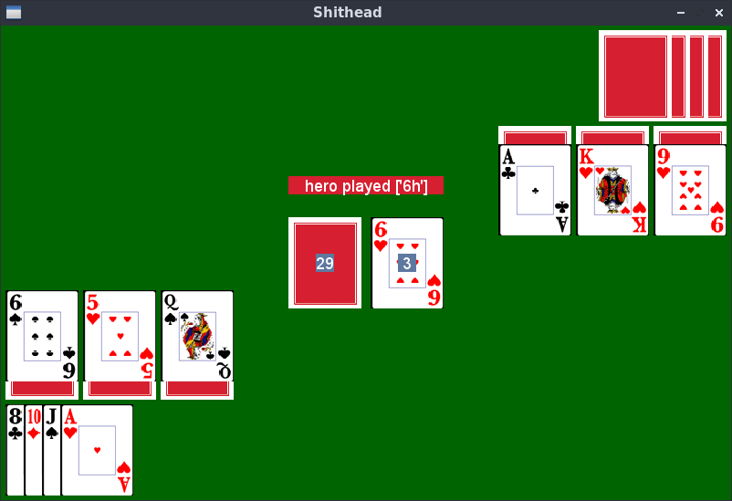

# Shithead

The card game [Shithead](https://en.wikipedia.org/wiki/Shithead_(card_game)) implemented in Python and PyGame.



## Requirements

```
sudo apt install git python-pip
```

## Installation


```
git clone https://github.com/rlefmann/Shithead.git Shithead
cd Shithead
pip install --user .
```

## Usage

To get started, simply execute the shithead program by typing:

```
$ python -m shithead
```

* Use the left and right arrow keys to move the cursor.
* Use the tab key to switch through the different card collections.
* Press the space bar to select a card and space again to unselect it. You can also select multiple cards, but only if they are from the same collection (switching between collections is disabled when a card is selected).
* Press return to play the selected cards. If you have selected the discard pile and pressed return you will take all the cards from it.

## Special Cards

The default special cards are:

* 2 to burn all cards from the discard pile
* 3 to make yourself invisible and skip your turn
* 7 to make the opponent skip his turn
* 9 to make the opponent play a card with rank 9 or lower

The 2 and 3 can be played on any card, while the 7 and 9 can only be played
if their rank allows it.
