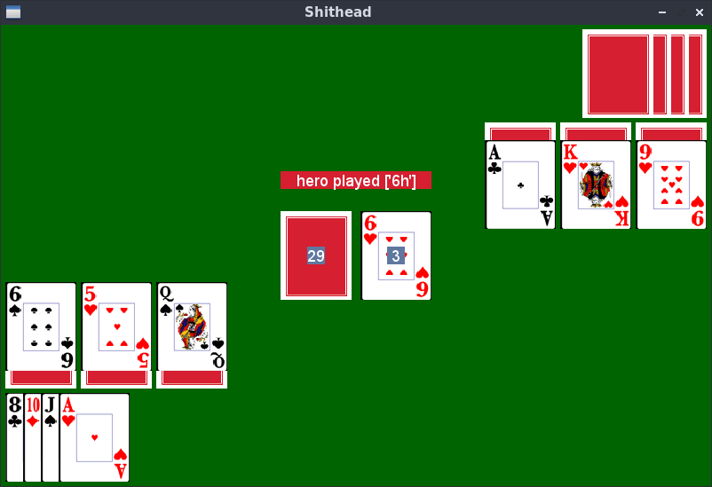

# Shithead

The card game [Shithead](https://en.wikipedia.org/wiki/Shithead_(card_game)) implemented in Python and PyGame.

## Usage

* Use the left and right arrow keys to move the cursor.
* Use the tab key to cycle through the different card collections.
* Press the space bar to select a card. You can also select multiple cards, but only if they are from the same collection (tab cycleing is blocked once a card is selected).
* Press return to play the selected cards. If you have selected the discard pile and pressed return you will take all the cards from it.
